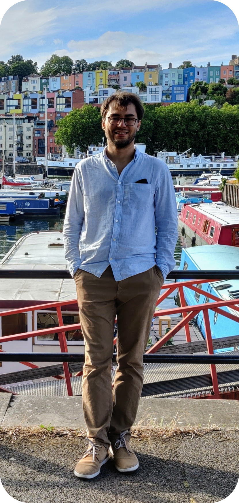
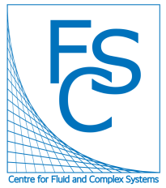

# Welcome to my webpage

## Dr. rer. nat. Sascha Wald

[Publications](https://saschawald.github.io/publications.html) - 
[Current Research](https://saschawald.github.io/research.html) - 
[Contact details](https://saschawald.github.io/contact.html) 

---
**UNDER CONSTRUCTION**
---

 

.
&nbsp;
&nbsp;
&nbsp;

  
---
  
      

&nbsp;
&nbsp;
&nbsp;
                                           
I am an **Assistant Professor** in the Statistical Physics Group
at the **Centre for Fluid and Complex Systems** at Coventry
University.

&nbsp;
&nbsp;
&nbsp;

Broadly, my interest revolves around **collective phenomena** and **quantum systems**.

  
---

- new states of matter
- thermalisation of quantum systems
- entanglement in interacting systems
- non-equilibrium quantum phase transitions
- quantum metrology
- network dynamics
- machine learning and quantum computing

Currently, I am a Lecturer and Research Associate at Coventry University.

