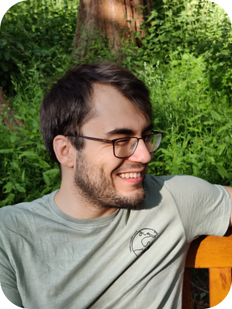

# Welcome to my Homepage

## Dr rer nat Sascha Wald

[Scholar](https://scholar.google.com/citations?user=yyjlIN0AAAAJ&hl=en) -
[arXiv](https://arxiv.org/a/wald_s_1.html) -
[OrcID](https://orcid.org/0000-0003-1013-2130)

---

## Navigation
[Publications](https://saschawald.github.io/publications.html) -
[Current Research](https://saschawald.github.io/research.html) -
[Contact details](https://saschawald.github.io/contact.html) -
[Teaching](https://saschawald.github.io/teaching.html)

---

 
## Work with me

Are you interested in quantum technologies and properties of complex quantum systems? 
Then reach out to me - I am always happy to discuss new collaborations.

Current positions:

[PhD - Universal Aspects of Non-Equilibrium Quantum Dynamics](https://www.jobs.ac.uk/job/CXQ654/phd-studentship-universality-in-non-equilibrium-quantum-systems)

---

## Recent preprints:

[arXiv:2211.01923](https://arxiv.org/abs/2211.01923) - 
[arXiv:2301.09143](https://arxiv.org/abs/2301.09143) -
[arXiv:2302.05732](https://arxiv.org/abs/2302.05732)

---

## About me

 

I am a **theoretical physicist** interested in collective properties of **complex systems**.

These systems are inspiring because of the variety of phenomena complex systems can describe, 
reaching from migrating birds to sozialising humans, from the global climate to the human brain
and even from city infrastructures to quantum computers.
The common feature these examples share is that they represent systems that are made of 
a multitude of individual constituents that come together to form more than just the 
sum of the parts.

I am particularly interested in collective properties of **quantum systems** and I study these 
**complex quantum systems in and out of equilibrium**.

---

## Brief vita

08/2022 - present: 
 **Assistant Professor**: Statistical Physics Group, Centre for Fluid and Complex Systems,
Coventry University, Coventry (UK).

11/2020 - 07/2022: **Lecturer and Reasearch Associate**:  
Statistical Physics Group, Centre for Fluid and Complex Systems, Coventry University, Coventry (UK).

11/2019 - 10/2020: **Postdoctoral Researcher**: 
Group for Dynamics in Correlated Quantum Matter, Max Planck Institute for the Physics of Complex Systems, Dresden (GER).

10/2019: **Visiting Professor**: 
Universidade Federal do ABC, Santo André (BR).

10/2017 - 09/2019: **Postdoctoral Researcher**: 
 Statistical Physics Group, SISSA - International School for Advanced Studies, Trieste (IT).

10/2014 - 09/2017: **PhD in Physics**: 
binational degree: Saarland University (GER) & University of Lorraine (FR).

10/2012 - 07/2014: **MSc in Physics**: 
binational degree: Saarland University (GER) & University of Lorraine (FR).

10/2009 - 08/2012: **BSc in Physics**: 
Saarland University (GER).

---

.
&nbsp;
&nbsp;
&nbsp;
