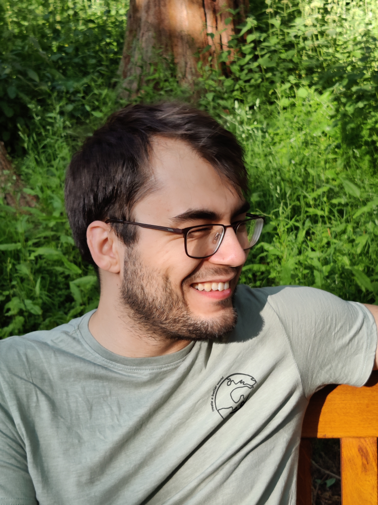

# Welcome to my webpage

## this page is work in progress

<a href="https://saschawald.github.io/contact.html">Contact details</a>

[Publications](https://saschawald.github.io/publications.html)
[Contact details](https://saschawald.github.io/contact.html)

 

I am a **Lecturer in Computational Physics** and a
**Research Associate** in the Statistical Physics Group
at the Centre for Fluid and Complex Systems at Coventry
University.

Lecturer in Computational Physics
& Research Associate 
@ Statistical Physics Group, Coventry University (UK)

---

Sascha is a *theoretical physicist* with a great interest in the description of non-equilibrium effects 
in complex systems. Strong interactions in these systems lead to collective effects that are described 
by statistical mechanics. 

My work focuses on describing such effects that are connected to

- thermalisation of quantum systems
- entanglement in interacting systems
- non-equilibrium quantum phase transitions
- quantum metrology
- network dynamics
- machine learning and quantum computing

Currently, I am a Lecturer and Research Associate at Coventry University.

