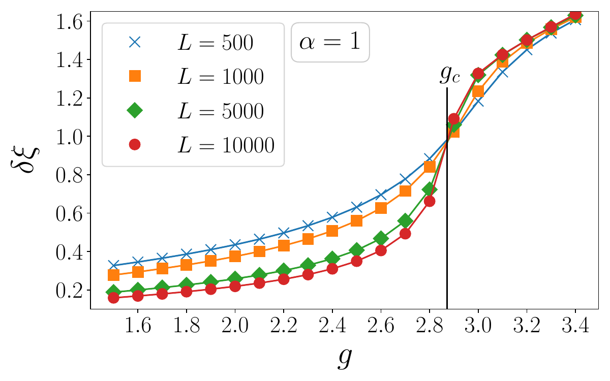

# Research Themes

## Non equilibrium quantum systems

...

---

## Entanglement in many-body quantum systems

 

...

---

## Quantum Walks
 

...

---

## Quantum field theory

...

---

## Study Groups

|Academic Year | Topic|
|---------------|:-------:|
21/22 | Machine Learning for Physicists|
22/23 | Statistical Field Theory|
|---------------|:-------:|
